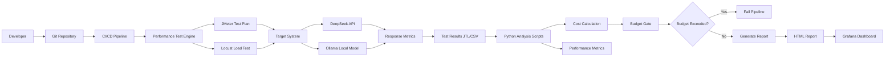

# 🚀 LLM Cost-Aware Performance Testing Platform

> 一个将 **成本控制（Cost-Aware）** 作为一等公民的大模型 API 性能测试平台，同时支持 **DeepSeek API** 和 **Ollama 本地部署**。


---

# 📋 项目简介

随着企业逐渐将 **大模型（LLM）能力接入业务系统**，性能测试不仅需要关注 **响应时间和吞吐量**，还必须关注 **API调用成本**。

本项目旨在解决企业接入 LLM 时面临的 **三大痛点**：

* **成本失控**：API账单每月翻倍，无法预测和控制
* **性能不均**：不同模型响应时间差异大，难以选择
* **缺乏标准**：没有统一的成本 + 性能评估体系

本平台通过 **性能测试 + 成本计算 + CI/CD质量门禁**，实现 **成本感知性能测试（Cost-Aware Performance Testing）**。

---

# ✨ 核心特性

| 特性           | 说明                                 |
| ------------ | ---------------------------------- |
| **双目标测试**    | 同时支持 DeepSeek 云端 API 和 Ollama 本地模型 |
| **成本感知**     | 实时计算每请求成本，累加预算，超预算自动失败             |
| **多维度指标**    | P95 / P99 响应时间、TPS、错误率、Token 消耗、成本 |
| **CI/CD 集成** | Jenkins Pipeline 自动执行测试            |
| **对比分析**     | 自动对比云端模型和本地模型                      |
| **可视化**      | HTML报告 + Grafana监控                 |

---

# 🏗️ 系统架构



---

# 🛠️ 技术栈

| 组件     | 技术                   | 用途    |
| ------ | -------------------- | ----- |
| 被测 API | DeepSeek API         | 云端大模型 |
| 本地模型   | Ollama + DeepSeek-R1 | 本地部署  |
| 测试工具   | JMeter 5.6+          | 性能压测  |
| CI/CD  | Jenkins Pipeline     | 自动化测试 |
| 数据分析   | Python + Pandas      | 结果分析  |
| 容器化    | Docker               | 环境一致性 |
| 数据库    | MySQL                | 结果存储  |
| 监控     | Prometheus + Grafana | 可视化监控 |

---

# 📁 项目结构

```
llm-cost-perf-test-platform
│
├── docker/                # Docker配置
├── jmeter/                # JMeter测试计划
├── scripts/               # Python分析脚本
├── config/                # 配置文件
├── results/               # 测试结果
├── docs/                  # 文档
│   └── images/
│
├── Jenkinsfile            # Jenkins流水线
├── Makefile               # 快捷命令
└── README.md
```

---

# 🚀 快速开始

## 前置条件

需要安装：

* Docker
* Docker Compose
* Python 3.9+
* JMeter 5.6+
* Git

---

# 克隆仓库

```bash
git clone https://github.com/yourname/llm-cost-perf-test-platform
cd llm-cost-perf-test-platform
```

---

# 配置环境变量

```bash
cp .env.example .env
```

编辑 `.env` 文件：

```
DEEPSEEK_API_KEY=your_api_key
```

---

# 启动系统

```bash
./start.sh
```

---

# 📊 运行测试

## DeepSeek API 测试

```bash
make api-test USERS=50 DURATION=300 BUDGET=1.0
```

---

## Ollama 本地模型测试

```bash
make ollama-test USERS=20 DURATION=300 MODEL=deepseek-r1:7b
```

---

## 对比测试

```bash
make compare
```

---

## 生成报告

```bash
make report
```

---

# 📊 测试结果示例

## 性能指标对比

| 模型           | 并发 | P95(ms) | TPS  | 错误率  | 成本($) |
| ------------ | -- | ------- | ---- | ---- | ----- |
| DeepSeek API | 20 | 1250    | 8.5  | 0.5% | 0.125 |
| Ollama 1.5B  | 20 | 850     | 12.3 | 0.1% | 0.000 |
| Ollama 7B    | 20 | 680     | 15.2 | 0.0% | 0.000 |

---

# 📈 成本趋势

```
请求数      成本($)
100        0.23
200        0.47
300        0.71
400        0.95
420        1.02
```

---

# 💰 预算控制示例

```
[INFO] 启动测试，预算: $1.00
[INFO] 完成 100 请求，累计成本: $0.23
[INFO] 完成 200 请求，累计成本: $0.47
[INFO] 完成 300 请求，累计成本: $0.71
[INFO] 完成 400 请求，累计成本: $0.95
[WARN] 预算使用 95%，接近上限
[INFO] 完成 420 请求，累计成本: $1.02
[ERROR] ❌ 预算超限！实际 $1.02 > 预算 $1.00
[ERROR] Pipeline 失败，阻止部署
```

---

# 📊 监控（可选）

如果启用 **Prometheus + Grafana**，可以实时监控：

* API响应时间
* TPS
* Token使用量
* 成本趋势

---

# 🔒 .gitignore建议

```
results/
reports/
*.jtl
*.csv

.venv/
__pycache__/

.idea/
.vscode/
```

---

# 🤝 贡献

欢迎提交 Issue 或 Pull Request 来改进本项目。

